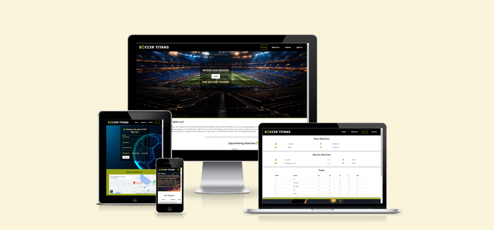

# SOCCER TITANS
Soccer Titans is a site built to aspire football players who dream of playing with the best. The site offers a responsive design that ensures a seamless browsing experience across all devices. It helps football players with everything they need to know about our club, from our mission to our games, and learn how they can join us.

Visit Live Site: [Soccer Titans](https://abdulrahman-365.github.io/soccer-titans/)

## CONTENTS
* [User Experience (UX)](#User-Experience-(UX))
    * [Site Goals](#Site-Goals)
    * [User Stories](#User-Stories)
        * [As a User](#As-a-User)
        * [As an Administrator](#As-an-Administrator)

* [Design](#Design)
    * [Features](#Features)
    * [Wireframes](#Wireframes)
    * [Color Schemes](#Color-Schemes)
    * [Typography](#Typography)
    * [Imagery](#Imagery)
    * [Accessibility](#Accessibility)

* [Technologies Used](#Technologies-Used)
    * [Languages](#Languages)
    * [Programs](#Programs)

* [Deployment](Deployment)

* [Testing](#Testing)
    * [Validator Testing](#Validator-Testing)
    * [Form Testing](#form-testing)
    * [Links Testing](#links-testing)
    * [Browser Testing](#browser-testing)
    * [Device Testing](#device-testing)
    * [Lighthouse Report](#Lighthouse-Report)
    * [Fixed Issues](#fixed-issues)
    * [Pending Issues](#pending-issues)
    * [Testing User Stories](#Testing-User-Stories)

* [Credits](#Credits)

* [acknowledgment](#acknowledgment)

- - -

## User Experience (UX)

### Site Goals
The goal of the website is to showcase the team and provide easy sign up process for users that would be of interest in joining the Soccer Titans. The site should be easy to navigate and satisfactory looking. The prospective players should be able to sign up easily and the administrator should be able to add features or make changes to the site.

### User Stories

#### As a User:
* To be able to access the site using the site address and from different platforms.
* To be able to easily navigate the site from the menu bar and easily access every page by clicking respective bar.
* To be able to skip to and access the 'Join us' page if clicked on the join button on the hero section.
* To be able to view the page header regardless the position of the page I'm at.
* To able to view the footer from all pages, click on the social media icons and open them on a different page.
* To be able to view all information on all pages.
* To be able to return to 'Home' page by clicking on the page title 'Soccer titans' of the page header. Also be able to access by clicking 'Home' link from the menu bar.
* To be able to sign up for the team on the 'Join Us' page by filling in the form my first name, last name and email address and chosing position.
* To be able to submit the form.
* To be able to view submitted data once filled in all fields of the form and clicked the submit button.
* To be able to click the map on 'Join Us' page and view the address of the team.

#### A an Administrator:
* To be able to add new features.
* To be able to edit existing features.
* To be able to update the website.
* To be able to allow or hide contents from the user.
* To be able to control what data to be captured in the form from the user.

- - -

## Design

### Features
- #### Navigation
  - The fully responsive navigation bar includes links to the Logo, Home, About Us, Join Us, Fixture and Join Us pages of the same website.

- #### The Landing Page Image
    - The landing page includes an eye-catching image with a text overlay describing the site's goal.
    - This section provides the user with a clear visual representation of the purpose of the site and a link to jump to Join Us page.

- #### Footer
    - The footer section includes links to Soccer Titans's Facebook, Twitter, Youtube and Instagram pages.
    - The links will open to a new tab to allow easy navigation for the user. 
    - The footer is valuable to the user as it allows them to find and follow Soccer Titans on social media.

### Wireframes
Wireframes created for mobile, tablet and desktop.

Mobile Wireframes For all pages

 

Tablet Wireframes for 'Home' and 'About Us' page

 

Tablet Wireframes for 'Fixtures' and 'Join Us' page

 

Desktop Wireframes for 'Home' and 'About Us' page

 

Desktop Wireframes for 'Fixture' and 'Join Us' page

 

### Color Schemes
Chose the color palettes based on the hero image photo, ensuring the colors reflect the energy and passion of football environment, with different colours.

Click to view Color Palettes

 

### Typography

Used Google Fonts to import the fonts that will be used in the website. The font chosen is Noto sans, which is a Sans Serif font.

Click to view Font Style

 

### Imagery
All images used within the site has been chosen to showcase the beautiful nature of soccer field.

All images used are created using AI. The link of the source website is mentioned in the credits section.

Hero Image

 

About Us Page Image

 

Fixture Page Image

 

Join US Page Image

 

### Accessibility
The following has been done to ensure that the website is as accessible friendly as possible.

* Using semantic HTML.
* Using descriptive alt attributes on images on the site.
* Ensuring that there is a sufficient colour contrast throughout the site.

- - -

## Technologies Used
### Languages
HTML5

CSS

### Programs
Balsamiq - Used to create wireframes.

Git - For version control.

Github - To save and store the files for the website.

[Coolors](https://coolors.co/) - To select the colour palette for the site.

Google Fonts - To import the fonts used on the website.

Font Awesome - For the iconography on the website.

Google Dev Tools - To troubleshoot and test features, solve issues with responsiveness and styling.

[Am I Responsive?](http://ami.responsivedesign.is/) To show the website image on a range of devices.

[Responsinator](http://www.responsinator.com/) - To verify responsiveness of website on different devices.

[W3C](https://www.w3.org/) - To validate HTML & CSS codes.

- - -

## Deployment
The project was deployed using GitHub pages. The steps to deploy using GitHub pages are:

1. Go to the repository on GitHub.com
2. Select 'Settings' near the top of the page.
3. Select 'Pages' from the menu bar on the left of the page.
4. Under 'Source' select the 'Branch' dropdown menu and select the main branch.
5. Once selected, click the 'Save'.
6. Deployment should be confirmed by a message on a green background saying "Your site is published at" followed by the web address.

- - -

## Testing
Testing was ongoing throughout the entire build. I utilised Chrome developer tools whilst building to pinpoint and troubleshoot any issues as I went along.

During development I made use of google developer tools to ensure everything was working correctly and to assist with troubleshooting when things were not working as expected.

I have gone through each page using google chrome developer tools to ensure that each page is responsive on a variety of different screen sizes and devices.

I have also used lighthouse to check the accessibility and performance of the site, together with W3 Validator to check the HMTL & CSS.

### Validator Testing
 - #### HTML
   - No errors were returned when passing through the official W3C Markup Validator.
     - [W3C Validator Results](https://validator.w3.org/nu/?doc=https%3A%2F%2Fabdulrahman-365.github.io%2Fsoccer-titans%2F)

- #### CSS
   - No errors were found when passing through the official W3C CSS Validator
     - [W3C CSS Validator Results](https://jigsaw.w3.org/css-validator/validator?uri=https%3A%2F%2Fabdulrahman-365.github.io%2Fsoccer-titans%2F&profile=css3svg&usermedium=all&warning=1&vextwarning=&lang=en)

### Form Testing
 - The form has been tested to ensure it would not submit without the required input fields being filled in (first name, last name and mobile number).

### Links Testing
 - All navigation links were tested manually to ensure the user is directed to the correct page of the website.
 - Social Media links in the footer of each page were tested manually to ensure they direct the user to the correct page and open in a new tab. 

### Browser Testing
 - The Website was tested on Google Chrome, Firefox, Microsoft Edge, Safari browsers with no issues noted.
    
### Device Testing
 - The website was viewed on a variety of devices such as Desktop, Laptop, iPhone 8, iPhoneX and iPad to ensure responsiveness on various screen sizes. The website performed as intended. The responsive design was also checked using Chrome developer tools across multiple devices with structural integrity holding for the various sizes.
 - I also used the following websites to test responsiveness:
     - [Responsinator](http://www.responsinator.com/?url=https%3A%2F%2Fabdulrahman-365.github.io%2Fsoccer-titans%2F)
     - [Am I Responsive](https://ui.dev/amiresponsive?url=https://abdulrahman-365.github.io/soccer-titans/)

### Lighthouse Reports
Lighthouse extension was downloaded and used to test the performance, accessibility, best practices and SEO of the website.

Overall, the lighthouse scores are very good for the desktop view but only the performance score for the mobile view under scoring. Only mobile view performance needs to be improved.

 - Desktop Repors
    - Home Page - [Lighthouse Viewer (googlechrome.github.io)](https://googlechrome.github.io/lighthouse/viewer/?psiurl=https%3A%2F%2Fabdulrahman-365.github.io%2Fsoccer-titans%2F&strategy=desktop&category=performance&category=accessibility&category=best-practices&category=seo&locale=en-GB&utm_source=lh-chrome-ext)
    - About Us Page - [Lighthouse Viewer (googlechrome.github.io)](https://googlechrome.github.io/lighthouse/viewer/?psiurl=https%3A%2F%2Fabdulrahman-365.github.io%2Fsoccer-titans%2Fabout.html&strategy=desktop&category=performance&category=accessibility&category=best-practices&category=seo&locale=en-GB&utm_source=lh-chrome-ext)
    - Fixture Page - [Lighthouse Viewer (googlechrome.github.io)](https://googlechrome.github.io/lighthouse/viewer/?psiurl=https%3A%2F%2Fabdulrahman-365.github.io%2Fsoccer-titans%2Ffixture.html&strategy=desktop&category=performance&category=accessibility&category=best-practices&category=seo&locale=en-GB&utm_source=lh-chrome-ext)
    - Join Us Page - [Lighthouse Viewer (googlechrome.github.io)](https://googlechrome.github.io/lighthouse/viewer/?psiurl=https%3A%2F%2Fabdulrahman-365.github.io%2Fsoccer-titans%2Fjoin.html&strategy=desktop&category=performance&category=accessibility&category=best-practices&category=seo&locale=en-GB&utm_source=lh-chrome-ext)

- Mobile Repors
    - Home Page - [Lighthouse Viewer (googlechrome.github.io)](https://googlechrome.github.io/lighthouse/viewer/?psiurl=https%3A%2F%2Fabdulrahman-365.github.io%2Fsoccer-titans%2F&strategy=mobile&category=performance&category=accessibility&category=best-practices&category=seo&locale=en-GB&utm_source=lh-chrome-ext)
    - About Us Page - [Lighthouse Viewer (googlechrome.github.io)](https://googlechrome.github.io/lighthouse/viewer/?psiurl=https%3A%2F%2Fabdulrahman-365.github.io%2Fsoccer-titans%2Fabout.html&strategy=mobile&category=performance&category=accessibility&category=best-practices&category=seo&locale=en-GB&utm_source=lh-chrome-ext)
    - Fixture Page - [Lighthouse Viewer (googlechrome.github.io)](https://googlechrome.github.io/lighthouse/viewer/?psiurl=https%3A%2F%2Fabdulrahman-365.github.io%2Fsoccer-titans%2Ffixture.html&strategy=mobile&category=performance&category=accessibility&category=best-practices&category=seo&locale=en-GB&utm_source=lh-chrome-ext)
    - Join Us Page - [Lighthouse Viewer (googlechrome.github.io)](https://googlechrome.github.io/lighthouse/viewer/?psiurl=https%3A%2F%2Fabdulrahman-365.github.io%2Fsoccer-titans%2Fjoin.html&strategy=mobile&category=performance&category=accessibility&category=best-practices&category=seo&locale=en-GB&utm_source=lh-chrome-ext)

### Fixed Issues
 - The Facebook icon link in the footer was linking nothing when clicked, found the issue was the fav icon used as the link was not included in anchor element, so I moved it in the achor element.
 - Most of the texts were not readable due to the color choices. So, I had to use an overlay to make the texts readable.
 - The AI image chosen from Adobe firefly were blury and there sizes was above 2.5 MB, after review with mentor, I decided to change them to new small sized AI images from freepik.com.
 - The achor links were not accessible to screen readers, so had to include aria-label to improve accesiibility. This was checked with lighthouse testing and performed full score.
 - Hero message was not resposive to most of larger screens, had to make use of css flexbox and successfully managed to fix most of them.

### Pending Issues
 - Although the site is responsive to most of the screens, there are some screen sizes that are still not responsive to it such as iPad landscape with: px and etc.

### Testing User Stories
`First time Users`

| Goals | How are they achieved? | Status |
| :--- | :--- | :--- |
| To be able to access the site using the site address and from different platforms | By using live Github link on Google, Edge, Firefox, Safari, etc. The user should then be able to land on the landing of the page | Confirmed |
| To be able to easily navigate the site from the menu bar and easily access every page | By hovering over and clicking the logo link, the user should be able to access the home (landing page) and by clicking the navigation links, the user should be able to visit selected bars and it should be highed separately from the other links | Confirmed |
| To be able to skip to and access the 'Join us' page if clicked on the join button on the hero section | When hovered over the join button link on hero image, the background color should change to keep focus and when clicked the user should be able to land on the join us page to be able to sign up or see location | Confirmed |
| To be able to view the page header regardless the position of the page I'm at | When scrolled, the user should be to view the header fixed to its position regardless the position of the page they are | Confirmed |
| To able to view the footer from all pages, click on the social media icons and open them on a different page | When scrolled to the bottom of the page, the user should be able to view the footer and when clicked the  icon links they should be able to view our social media sites | Confirmed |
| To be able to view all information on all pages | By Scrollingt to the bottom on all pages and view every information | Confirmed |
| To be able to return to 'Home' page by clicking on the page title 'Soccer titans' of the page header. Also be able to access by clicking 'Home' link from the menu bar | Click on the title header and the user should return to home page | Confirmed |
| To be able to sign up for the team on the 'Join Us' page by filling in the form my first name, last name and email address and chosing position | Fill in the fields with all of them beign required | Confirmed |
| To be able to submit the form | By clicking on the submit button | Confirmed |
| To be able to view submitted data once filled in all fields of the form and clicked the submit button | by receiving the returned form data from code institute formdump and view submited data | Confirmed |
| To be able to click the map on 'Join Us' page and view the address of the team | Hover over the map and be able to zoom in and zoom out of the teams location in satellite and street map | Confirmed |

- - -

## Credits

[Freepik](https://www.freepik.com/) Used to generate AI images used on the site.

[W3Schools](https://www.w3schools.com/) Used as a resourceful tool to access some of the dictionary codes for HTML and CSS.

[Coolers](https://coolors.co/) - Used to generate color palettes for the site.

- - -

## Acknowledgment
My mentor Antonio for his support and advice.

My Facilitator Amy for supportive resources share over slack and advice.

Kera Cudmore for her helpful tips on how to write an excellent README file.
- - -

